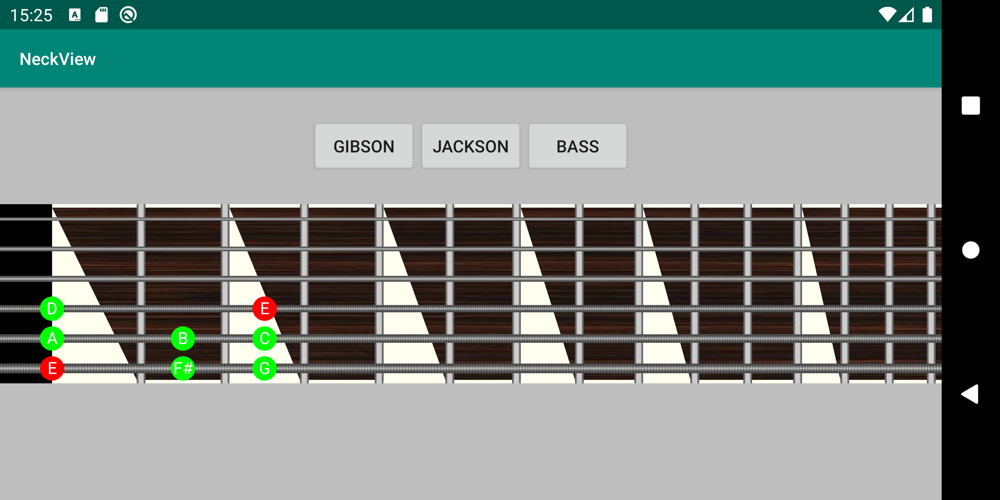

[](https://maven-badges.herokuapp.com/maven-central/com.github.spelcrawler/neckview)

# NeckView
Simple guitar neck view



Download
--------

Gradle:

```
dependencies {
  implementation 'com.github.spelcrawler:neckview:0.9.3'
}
```

Usage
-----

You can find sample app [here](https://github.com/Spelcrawler/NeckView/tree/master/app)

Layout file:

```xml
<com.spelcrawler.neckview.NeckView
    android:id="@+id/neckView"
    android:layout_width="match_parent"
    android:layout_height="match_parent"/>
```

Setup code:

```java
NeckView neckView = findViewById(R.id.neckView);

neckView.setFretWidth(25f);
neckView.setNutWidth(150f);
neckView.setupGuitarStrings(6, 3, 6, 28);
neckView.setFinishWith(10);
neckView.setFretCount(15);
neckView.setNeckRightPadding(30);

neckView.setFretboardNut(new ColorFretboardNut(Color.BLACK));
neckView.setFretboardTop(new DrawableFretboardTop(R.drawable.neck_top));
neckView.setFret(new TexturedFret(Color.LTGRAY));
neckView.setFretboardFinish(new ColorFretboardFinish(0xFFFFFFF0));
neckView.setFretboardBinding(new TriangleColorFretboardBinding(0xFFFFFFF0));
neckView.setFretboardString(new TexturedFretboardString(0xFFB8B8B6));
neckView.setBoundFrets(Arrays.asList(1, 3, 5, 7, 9, 12));

```


